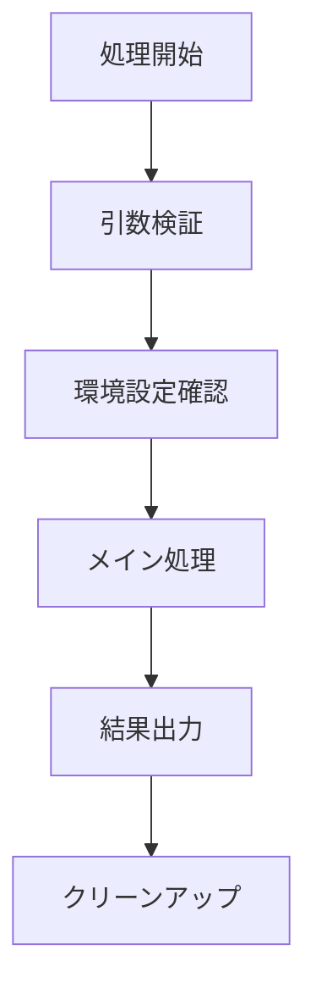

# [ファイルパス]: [機能・目的の概要] #issue番号
[`path/to/file`](path/to/file)

/label ~"status::doing（実施中）"
/label ~"Spec-Document（仕様書）"
/label ~"pj::"

### 変更履歴
- 2025-MM-DD 初版 #[issue番号]
- 2025-MM-DD [変更内容] #[issue番号]

### 参考リンク
- #[関連issue番号] [関連内容の説明]

### インストール/セットアップ手順
#### セットアップ
- 環境変数の設定
- 前提条件の準備

#### インストール
- ファイルの配置
- 設定ファイルの更新
- `source ~/.bashrc` などの設定読み込み

### 使い方
```bash
# 基本的な使用例
command [options] [arguments]
```
- `[arguments]` の説明
- 実行後の動作説明

### オプション
- `[option]`: [説明]
- `[option]`: [説明]

### 目的・背景
- なんのためにこのファイル・ツールを作成するか
- これで何が解決できるか
- どのようなワークフローを実現するか

### 入出力仕様
- 入力
  - 引数: [引数名] ([必須/任意])
  - 環境変数: [変数名リスト]
  - ファイル: [入力ファイルパス]
- 出力
  - [出力内容の説明]
  - [副作用（ファイル作成、ブラウザ起動など）]
- エラー
  - [エラー条件とエラーコード]

### 処理フロー
主要ステップの概要:


### 依存関係
- `command1` - [用途説明]
- `command2` - [用途説明]
- `library` - [バージョン要件があれば明示]

### ディレクトリ構成・他ファイルとの関係
```bash
.
├── [directory]/
│   └── [subdirectory]/
│       └── [main_file]           # メインファイル
│       └── [config_file]         # 設定ファイル
└── [working_directory]/          
    └── [input_files]             # 入力・作業ファイル
```

### 設定項目
| 変数名 | 既定値 | 説明 |
| ------ | ------ | ---- |
| `VARIABLE_NAME` | [default_value or "なし (必須)"] | [変数の説明] |
| `OPTIONAL_VAR`  | [default_value] | [変数の説明] |

### ビルド/デプロイ手順
- [ビルドが不要な場合] シェルスクリプトのためビルド不要
- [設定方法] `.bashrc` などに関数を読み込ませるだけで利用可能
- [その他の手順があれば記載]

### テスト方針
- `shellcheck` による静的解析（シェルスクリプトの場合）
- [機能テスト項目]
  - [テスト項目1]
  - [テスト項目2]
- [結合テスト項目があれば記載]

### テスト方法
```bash
# 静的解析
shellcheck [script_path]

# インストール・設定
[installation_commands]

# 機能テスト
[test_commands]

# クリーンアップ
[cleanup_commands]
```

### メモ
- TODO / 既知の課題
- 改善案・将来の拡張
- パフォーマンス上の注意点（想定同時実行数、メモリ上限など）
- セキュリティ上の注意点（権限、入力検証、脆弱性対策など）
- トラブルシューティング（エラー時の確認箇所）
- プラットフォーム固有の制限（Windows対応など）

